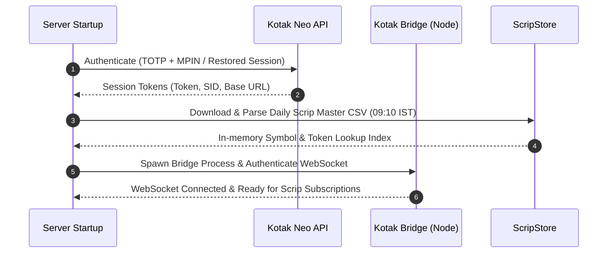
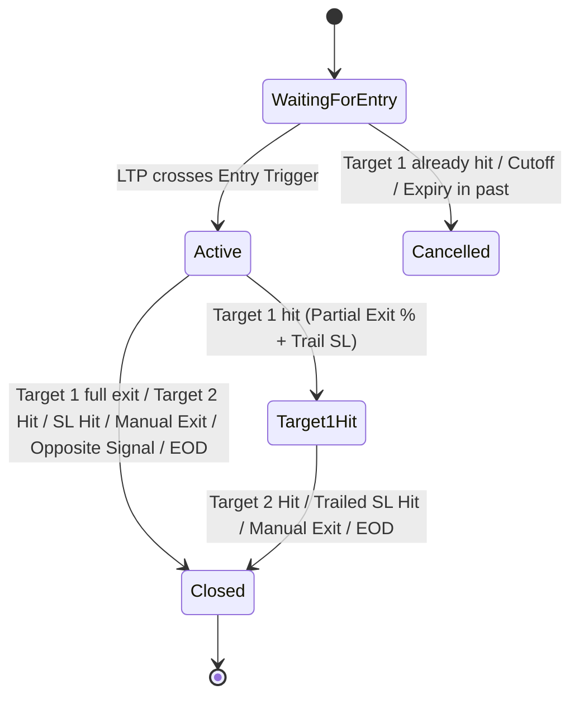
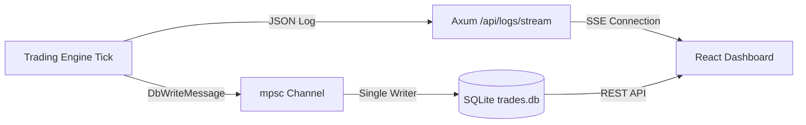

# Trade Lifecycle & System Architecture

This document provides a comprehensive, end-to-end breakdown of how the **Auto Trader** platform operates: from pre-market broker synchronization and Telegram signal parsing, to position sizing, 50ms tick monitoring, multi-stage target exits, safety invariants, and accounting.

---

## 1. High-Level Architecture

The system is organized as a multi-crate Rust workspace backed by a Node.js binary WebSocket bridge, SQLite (WAL mode) database, and a React 19 / Vite dashboard:

```
┌────────────────────────────────────────────────────────────────────────┐
│               Telegram Channels (MTProto Userbot)                      │
└───────────────────────────────────┬────────────────────────────────────┘
                                    │ grammers-client
                                    ▼
┌────────────────────────────────────────────────────────────────────────┐
│ telegram_ingester  —  Regex parser & Signal/Reply extractor            │
└───────────────────────────────────┬────────────────────────────────────┘
                                    │ TradeSignal (broadcast channel)
                                    ▼
┌────────────────────────────────────────────────────────────────────────┐
│ trading_engine  —  50ms Tick Engine & Position State Machine           │
│  [WaitingForEntry] ──▶ [Active] ──▶ [Target1Hit] ──▶ [Closed]          │
│                      ▲                ▲                                │
│       LTP Feed       │                │ Orders & Reconcile             │
│   (Kotak Bridge)     │                │                                │
└───────────────┬──────┴────────────────┴────────┬───────────────────────┘
                ▼                                ▼
┌────────────────────────────────┐   ┌───────────────────────────────────┐
│ kotak_client & kotak-bridge    │   │ SQLite Database (WAL Mode)        │
│ Node.js HSM Binary Feed (WS)   │   │ Single-writer channel (db_writer) │
│ Kotak REST API (Login & Exec)  │   │ Wallet, Trades, Logs, Snapshots   │
└────────────────────────────────┘   └─────────────────┬─────────────────┘
                                                       │
                                                       ▼
                                     ┌───────────────────────────────────┐
                                     │ server (Axum :8080) + SSE Stream  │
                                     │ frontend (React 19 Dashboard)     │
                                     └───────────────────────────────────┘
```

### Core Crates & Components

1. **`backend/shared_domain`**: Shared data contracts (`TradeSignal`, `TradingConfig`, `MonitoredPosition`, `DbWriteMessage`), and IST (`UTC+05:30`) time utilities.
2. **`backend/telegram_ingester`**: MTProto client connecting as a regular Telegram user, monitoring channels, parsing signals, and extracting reply actions.
3. **`backend/trading_engine`**: The 50ms stateful OMS (Order Management System), scrip master indexer, position manager, and statutory fee engine.
4. **`backend/kotak_client`**: Kotak Neo REST API client (login, order placement, order status, cancel/modify) and child process manager for `kotak-bridge`.
5. **`kotak-bridge/`**: Node.js microservice handling Kotak's binary HSM WebSocket market data feed, streaming clean JSON ticks to Rust.
6. **`backend/server`**: Axum HTTP API, static SPA server, SSE log streamer, and serialized SQLite DB writer task.
7. **`frontend/`**: Vite + React 19 + Tailwind dashboard displaying live positions, P&L graphs, configuration, and daily trade analytics.

---

## 2. Phase 1: Pre-Market Setup & Initialization

Before processing trade signals, the system initializes authentication, market data, and contract catalogs:



1. **Kotak Neo Session Management**:
   - Sessions expire daily. The backend checks `kotak_session` in SQLite.
   - If missing or expired, the backend automatically logs in at **09:05 IST** using `KOTAK_TOTP_SECRET` (RFC 6238 TOTP) and `KOTAK_MPIN`, retrying at **09:15 IST** if needed.
2. **Scrip Master Ingestion (`09:10 IST`)**:
   - Downloads the full Kotak NSE/BSE equity and derivatives master files.
   - Indexes options by `(Underlying, Expiry, Strike, OptionType)` to immediately resolve exchange tokens (e.g. `nse_fo|42150`) and lot sizes.
3. **Market Feed Spawning**:
   - Spawns `kotak-bridge/index.js` using Node.js to establish the HSM binary WebSocket connection.
   - Decoded market ticks update the shared in-memory `ltp_map` (`segment|token -> LTP`).

---

## 3. Phase 2: Signal Ingestion & Telegram Parsing

Signals are ingested from Telegram channels or injected manually via `POST /api/webhook/telegram`.

### 1. New Trade Signal Format
Messages matching option and equity signal templates are parsed via regular expressions:
```text
BUY BHEL 425 CE ABOVE 8.25
TARGET :- 9.50 / 11.50
SL :- 5
JULY EXPIRY
```

The regex parser extracts:
- **Action**: `BUY` (options buying only; the account carries no margin).
- **Instrument**: `BHEL`.
- **Strike & Type**: `425 CE` (or `PE`, or Equity if strike/type are absent).
- **Entry Trigger**: `ABOVE` or `BELOW` condition + trigger price (`8.25`).
- **Targets**: Ordered list `[9.50, 11.50]`.
- **Stop-Loss**: Initial stop level `5.00`.
- **Expiry**: Parsed date or defaulted to nearest active expiry.

### 2. Signal Reply Actions
When an admin replies directly to a prior trade call in Telegram:
- **SL Modification** (`SL to 6.50` / `Move SL to 6.0`): Emits an `UPDATE_SL` signal that adjusts `current_sl` on the active position in real-time.
- **Forced Exit** (`exit @ 11.0` / `exit all`): Emits an `EXIT_AT` signal triggering an immediate exit with reason `Exit via Telegram Msg`.

---

## 4. Phase 3: Validation, Sizing & Position Creation

When a parsed `TradeSignal` arrives at the trading engine:

1. **Safety Checks & Rejections**:
   - Discards signals with missing/zero stop loss or missing targets (`stop_loss <= 0.0 || targets.is_empty()`) to prevent opening unprotected trades.
   - Rejects expired dates (`expiry < today_ist()`).
   - If the instrument lot configuration is set to `0` in settings, the signal is skipped.
2. **Scrip Resolution**:
   - Resolves the exact contract token and exchange segment using `ScripStore`.
   - Dispatches a subscription request over `ws_tx` to `kotak-bridge` so live prices begin streaming immediately for that token.
3. **Position Sizing**:
   - **Indices (NIFTY, BANKNIFTY, SENSEX, etc.)**: Configured lot count $\times$ index lot size.
   - **Stock Options**: `other_lots` $\times$ contract lot size.
   - **Equity**: Quantities sized to match `max_trade_amount_inr / ltp`.
4. **Opposite Direction Auto-Exit**:
   - If an existing active position on the same underlying exists in the opposite direction (e.g., holding `NIFTY CE` and a `NIFTY PE` signal arrives), the old position is flagged for immediate liquidation with reason `"Opposite Signal Exit"`.
5. **Enqueued in State Machine**:
   - Added to the active monitoring vector with status `TradeState::WaitingForEntry`.

---

## 5. Phase 4: 50ms Position Tick Loop & State Machine

The position monitor checks all open positions every **50 milliseconds**:



### State 1: `WaitingForEntry`
- Compares live tick price (`LTP`) against `entry_price` based on `entry_condition`:
  - `ABOVE`: Triggers when $\text{LTP} \ge \text{entry\_price}$.
  - `BELOW`: Triggers when $\text{LTP} \le \text{entry\_price}$.
- **Late Signal Guard**: If $\text{LTP} \ge \text{target\_1}$ before entry triggers, the trade is cancelled (preventing entering at an exhausted move).
- **Entry Execution**:
  - **PAPER Mode**: Records virtual BUY at trigger price, updates paper wallet balance.
  - **LIVE Mode**: Submits market BUY order via Kotak REST API and updates executed quantity.
  - State moves to `TradeState::Active`.

---

### State 2: `Active` Monitoring & Risk Rules

Every tick evaluates the position against conditions in the following priority order:

1. **Stop-Loss Hit (Initial SL)**:
   - Condition: $\text{LTP} \le \text{current\_sl}$ (for Long Calls/Puts).
   - Action: Liquidates 100% of remaining position at market.
   - Exit Reason: `"SL Hit"`.
   - Transitions to: `TradeState::Closed`.

2. **Target 1 Hit (Partial Profit & SL Trailing)**:
   - Condition: $\text{LTP} \ge \text{target\_1}$.
   - Action:
     - Liquidates `target_1_exit_pct` (e.g. 50%) of executed quantity.
     - Automatically trails the stop-loss for the remaining quantity to:
       $$\text{Trailed SL} = \frac{\text{Average Buy Price} + \text{Target 2}}{2}$$
   - Transitions to: `TradeState::Target1Hit` (or `TradeState::Closed` if 100% exit was configured).

3. **Target 2 / Final Target Hit**:
   - Condition: $\text{LTP} \ge \text{target\_2}$.
   - Action: Liquidates 100% of remaining quantity.
   - Exit Reason: `"Target 2 Hit"`.
   - Transitions to: `TradeState::Closed`.

4. **External & Manual Exit Triggers**:
   - **Telegram Reply (`EXIT_AT`)**: Exits position immediately $\to$ `"Exit via Telegram Msg"`.
   - **Opposite Signal**: Liquidated due to reverse call $\to$ `"Opposite Signal Exit"`.
   - **Manual UI Close**: Trader clicks "Close" on dashboard $\to$ `"Closed via Frontend"`.
   - **EOD Square-off**: Automatically closed at `15:15 IST` on expiry day or before market close $\to$ `"EOD Square-off"`.

---

### State 3: `Target1Hit` Monitoring
- Protects the remaining runner quantity:
  - If $\text{LTP} \ge \text{target\_2} \implies$ Sells remaining quantity with reason `"Target 2 Hit"`.
  - If $\text{LTP} \le \text{trailed\_sl} \implies$ Sells remaining quantity with reason `"Trailed SL Hit"`.

---

## 6. Phase 5: Brokerage Safety Invariants & Statutory Charges

### Brokerage Safety Invariant (Live Trading)
Because options trading in this account operates without margin:
$$\text{Resting Stop Qty} + \text{In-flight Sell Qty} \le \text{Executed Qty}$$

- When an exit trigger fires, the engine **cancels or shrinks resting stop orders first**.
- Only after stop modification succeeds does it dispatch the market exit order.
- This prevents accidental naked shorting or overselling.

### Statutory Charge Calculation (`FeeCalculator`)
For every trade leg, exact regulatory charges are calculated:

| Charge | Options Calculation | Equity Intraday Calculation |
|---|---|---|
| **Brokerage** | Flat ₹20 per executed leg (configurable) | Flat ₹20 per executed leg |
| **SEBI Turnover Fee** | $0.0001\%$ of turnover | $0.0001\%$ of turnover |
| **Exchange Turnover Fee (NSE)** | $0.00297\%$ of turnover | $0.00297\%$ of turnover |
| **STT (Securities Transaction Tax)** | $0.05\%$ on **SELL side only** | $0.025\%$ on **SELL side only** |
| **Stamp Duty** | $0.003\%$ on **BUY side only** | $0.003\%$ on **BUY side only** |
| **GST** | $18\% \times (\text{Brokerage} + \text{SEBI Fee} + \text{Exchange Fee})$ | $18\% \times (\text{Brokerage} + \text{SEBI Fee} + \text{Exchange Fee})$ |

$$\text{Net Realized P&L} = \text{Net Sell Inflow} - \text{Net Buy Outflow}$$

---

## 7. Phase 6: Persistence, SSE Streaming & Dashboard



1. **Serialized SQLite Persistence**:
   - All database writes (trades, ledger transactions, positions snapshots, logs) are sent over an async `mpsc::channel` to `db_writer`.
   - Eliminates SQLite concurrency locks (`SQLITE_BUSY`) while maintaining write-ahead logging (WAL).
2. **Real-time SSE Stream (`/api/logs/stream`)**:
   - Streams live JSON events (`SIGNAL_RECEIVED`, `ORDER_PLACED`, `TARGET_HIT`, `SL_HIT`, `TRADE_CLOSED`) directly to the browser terminal.
3. **Daily Reports & Trade Analytics**:
   - The `/reports` view aggregates performance by calendar date and original Telegram `signal_id`.
   - Provides itemized trade logs showing raw Telegram call text, entry/exit fills, exact statutory fees, and net realized P&L.
